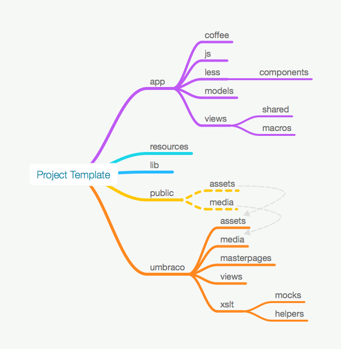

# Project Template

Because I seem to always change my "default" setup, I thought It'd be a good idea to put it on GitHub and kinda keep up with all the changes.

**Disclaimer:** *Everything's subject to change at any point!*

Currently, this is what I start with when developing a new site using Umbraco.

I use [TextMate 2][TM2] to code CoffeeScript, Less, XML, XSLT, C# and Kit files, with [CodeKit 2][CK2] taking care of preprocessing and serving the app. I can't tell you how totally awesome it is *not* to have a gazillion node_modules and configs that constantly needs to be kept up-to-date, just to be able to actually do some coding. But now I've at least tried to tell you :-)

## Usage

The idea was to do something like this:

```bash
$ git clone https://github.com/greystate/project-template --branch pristine --single-branch "NEW_PROJECT_NAME"
$ rm -rf "NEW_PROJECT_NAME/.git"
```

(The pristine branch doesn't have any of the files that are just used to describe the project, e.g. this README, image etc.)

This should create a structure like this:



A couple of notes to go with that:

* CodeKit serves the `public` folder as a website
* `public/assets` and `public/media` are *symlinked* to `umbraco/assets` and `umbraco/media` respectively
* The `umbraco/assets` folder contains all CSS, JavaScript and images for the design
* The `umbraco/media` folder contains any content images that needs to be 
* **.coffee** and **.less** files all compile into the `umbraco/assets` folder


Let's see how that fares in the future :-)


[TM2]: http://macromates.com/
[CK2]: http://incident57.com/codekit/