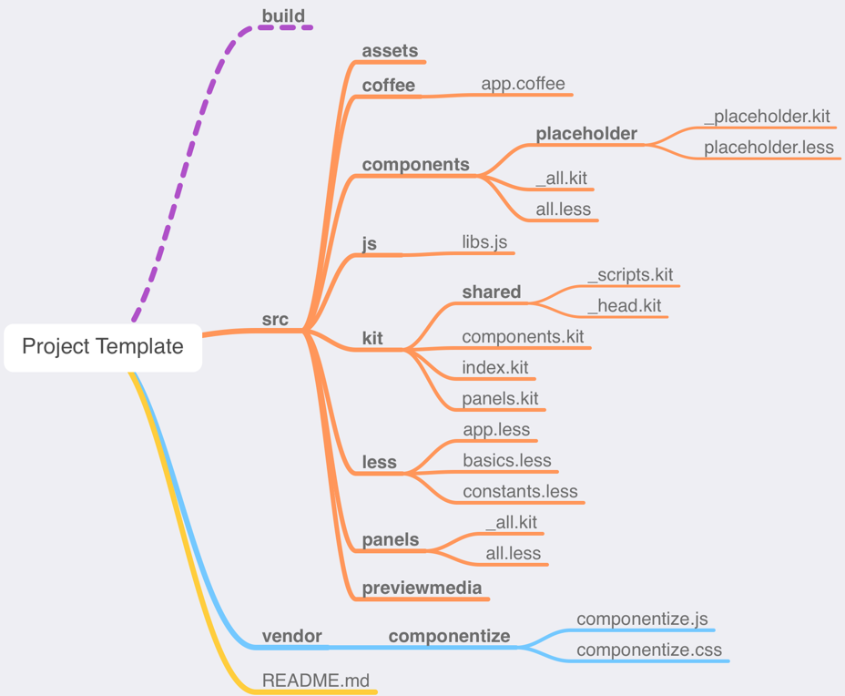

# Project Template

Because I seem to always change my "default" setup, I thought It'd be a good idea to put it on GitHub and kinda keep up with all the changes.

**Disclaimer:** *Everything's subject to change at any point!*

Currently, this is what I start with when developing a new site's frontend code.

I use [TextMate 2][TM2] for all coding, i.e. HTML, CSS, JavaScript, CoffeeScript, LESS, XML, XSLT, C#/Razor and Kit, with [CodeKit 3][CK3] taking care of preprocessing and serving the prototype site.

CodeKit is totally awesome because it frees me from having a gazillion *node_modules* and *configs* that constantly needs to be kept up-to-date, just to be able to actually do some coding.

Another cool thing about CodeKit is that it can run in read-only mode if you don't use/need it yourself for developing, but you want to try out someone else's project. It will just read the config and build the files *and* serve the site for you. For free.

## Usage

The idea is to do something like this:

```bash
$ git clone https://github.com/greystate/project-template --branch pristine --single-branch "NEW_PROJECT_NAME"
$ rm -rf "NEW_PROJECT_NAME/.git"
$ git init .
```

(The pristine branch doesn't have any of the files that are just used to describe the project, e.g. this README, the file-structure image below, etc.)

This should create a structure like this:



A couple of notes to go with that:

* CodeKit creates and serves the `build` folder as a website
* The `src/previewmedia` folder contains any content images that are used for the prototype, but are meant to be served from a CMS or similar
* The `src/assets` folder contains graphics/images that are part of the design
* **.coffee**, **.less**, **.css** and **.js** files all compile/process into the `build/assets` folder which then contains all the CSS, JavaScript and images for the design


Let's see how that fares in the future :-)


[TM2]: https://macromates.com/
[CK3]: https://codekitapp.com/
